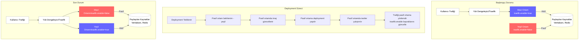

```mermaid

flowchart TD
    subgraph "Başlangıç Durumu"
        A[Kullanıcı Trafiği] --> LB[Yük Dengeleyici/Traefik]
        LB --> B[Mavi Ortam\ntraefik.enable=true]
        G[Yeşil Ortam\ntraefik.enable=false]
        
        B -->|Aktif| DB[(Paylaşılan Kaynaklar\nVeritabanı, Redis)]
        G -->|Pasif| DB
    end
    
    subgraph "Deployment Süreci"
        DP1[Deployment Tetiklenir] --> DP2[Pasif ortam belirlenirn - yeşil]
        DP2 --> DP3[Pasif ortamda imaj güncellenir]
        DP3 --> DP4[Pasif ortama deployment yapılır]
        DP4 --> DP5[Pasif ortamda testler çalıştırılır]
        DP5 --> DP6[Trafiği pasif ortama yönlendir\ntraefik.enable bayraklarını güncelle]
    end
    
    subgraph "Son Durum"
        A2[Kullanıcı Trafiği] --> LB2[Yük Dengeleyici/Traefik]
        LB2 --> B2[Mavi Ortamntraefik.enable=false]
        LB2 --> G2[Yeşil Ortamntraefik.enable=true]
        
        B2 -->|Pasif| DB2[(Paylaşılan Kaynaklar\nVeritabanı, Redis)]
        G2 -->|Aktif| DB2
    end
    
    classDef active fill:#66f,stroke:#33f,color:white;
    classDef inactive fill:#f66,stroke:#f33,color:white;
    classDef neutral fill:#fff,stroke:#999,color:black;
    
    class B,G2 active;
    class G,B2 inactive;
    class DB,DB2,LB,LB2,A,A2 neutral;


    

```