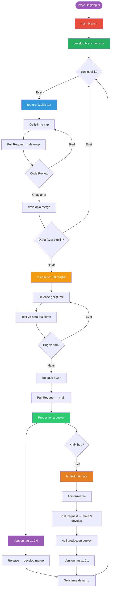
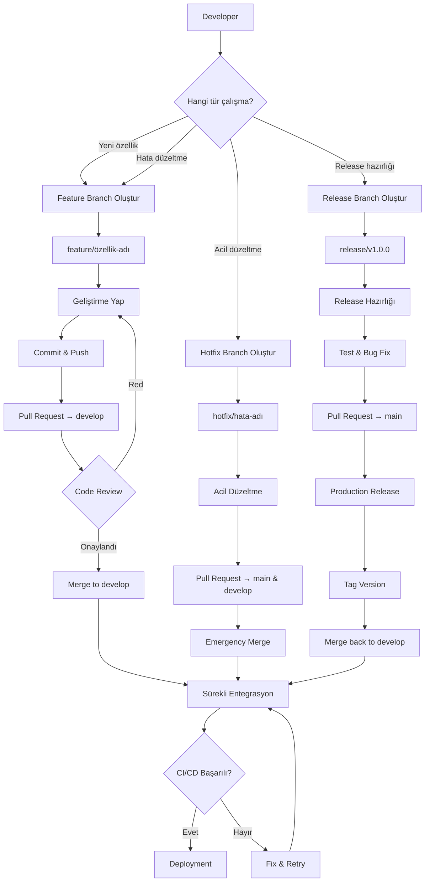
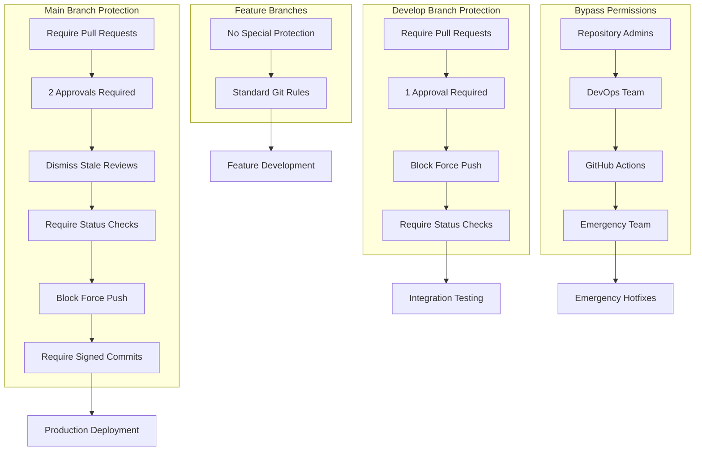
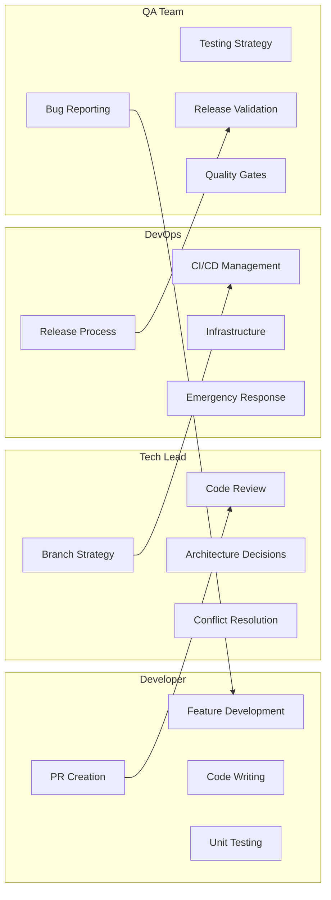
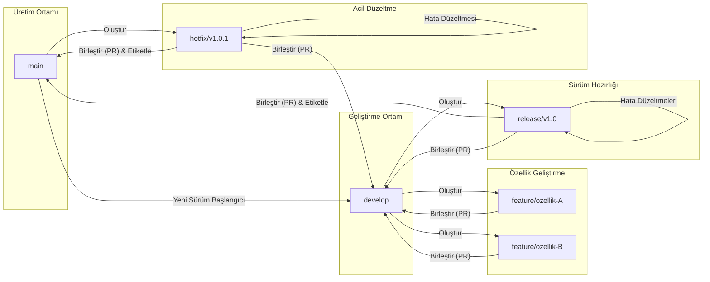
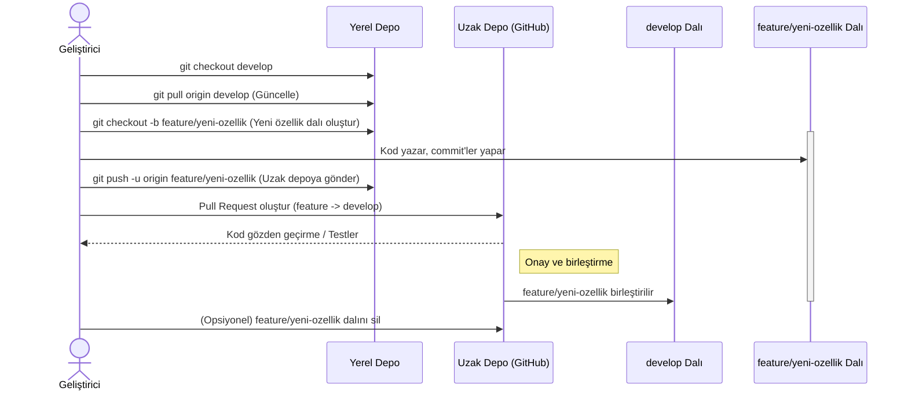
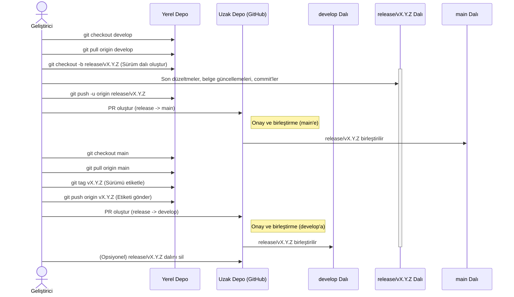
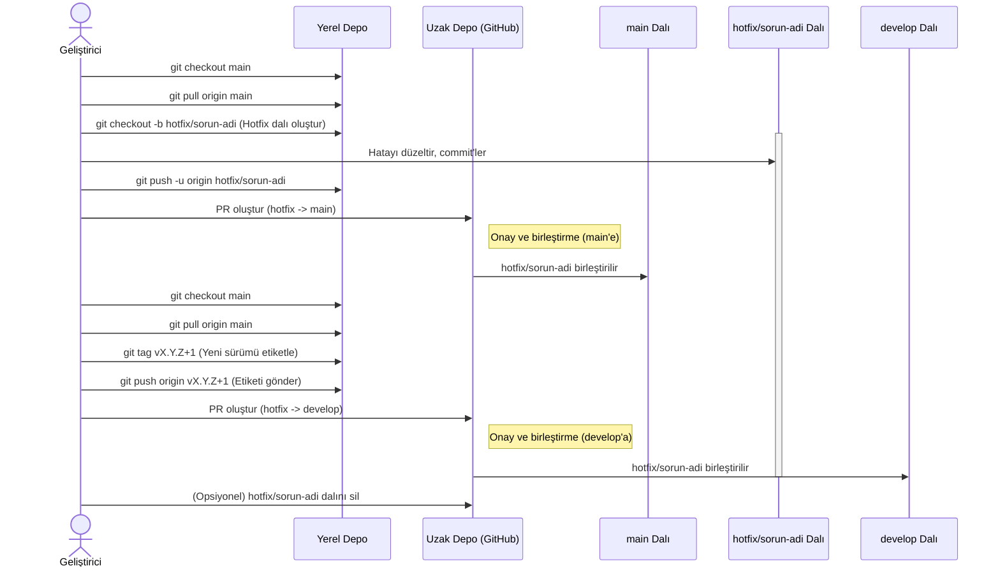

# GitHub Gitflow Kurulum Yol Haritası

## 🌊 Gitflow Branch Yapısı

```mermaid
graph LR
    subgraph "Main Timeline"
        A[Başlangıç] --> M1[v1.0.0 Yayınlandı]
        M1 --> M2[v1.0.1 Acil Düzeltme]
    end
    
    subgraph "Develop Timeline"
        A --> D1[Temel Geliştirme]
        D1 --> D2[Altyapı Kurulumu]
        D2 --> D3[Özellik A Birleştirildi]
        D3 --> D4[API Güncellemeleri]
        D4 --> D5[Özellik B Birleştirildi]
        D5 --> D6[Release Geri Alındı]
        D6 --> D7[Hotfix Geri Alındı]
        D7 --> D8[Yeni Geliştirmeler...]
    end
    
    subgraph "Feature/Kullanici Branch"
        D2 --> F1[Kayıt Formu]
        F1 --> F2[Giriş İşlevi]
        F2 --> D3
    end
    
    subgraph "Feature/Raporlama Branch"
        D4 --> F3[Rapor Arayüzü]
        F3 --> F4[Veri Entegrasyonu]
        F4 --> D5
    end
    
    subgraph "Release/v1.0.0 Branch"
        D5 --> R1[Sürüm Hazırlığı]
        R1 --> R2[Belge Güncellemeleri]
        R2 --> R3[Hata Düzeltmeleri]
        R3 --> M1
        R3 --> D6
    end
    
    subgraph "Hotfix/Login Branch"
        M1 --> H1[Kritik Giriş Hatası]
        H1 --> M2
        H1 --> D7
    end
    
    style A fill:#ff6b6b,stroke:#c0392b,color:#fff
    style M1 fill:#ff6b6b,stroke:#c0392b,color:#fff
    style M2 fill:#ff6b6b,stroke:#c0392b,color:#fff
    
    style D1 fill:#4ecdc4,stroke:#16a085,color:#fff
    style D2 fill:#4ecdc4,stroke:#16a085,color:#fff
    style D3 fill:#4ecdc4,stroke:#16a085,color:#fff
    style D4 fill:#4ecdc4,stroke:#16a085,color:#fff
    style D5 fill:#4ecdc4,stroke:#16a085,color:#fff
    style D6 fill:#4ecdc4,stroke:#16a085,color:#fff
    style D7 fill:#4ecdc4,stroke:#16a085,color:#fff
    style D8 fill:#4ecdc4,stroke:#16a085,color:#fff
    
    style F1 fill:#45b7d1,stroke:#2980b9,color:#fff
    style F2 fill:#45b7d1,stroke:#2980b9,color:#fff
    style F3 fill:#45b7d1,stroke:#2980b9,color:#fff
    style F4 fill:#45b7d1,stroke:#2980b9,color:#fff
    
    style R1 fill:#f9ca24,stroke:#f39c12,color:#fff
    style R2 fill:#f9ca24,stroke:#f39c12,color:#fff
    style R3 fill:#f9ca24,stroke:#f39c12,color:#fff
    
    style H1 fill:#f0932b,stroke:#e67e22,color:#fff
```



## 🔄 Gitflow Süreç Detayları



## 🔄 Gitflow Süreç Akışı



## 🏗️ GitHub Repository Kurulum Aşamaları

```mermaid
gantt
    title Gitflow Kurulum Zaman Çizelgesi
    dateFormat  X
    axisFormat %d
    
    section Hafta 1: Hazırlık
    Takım Planlaması           :active, plan, 1, 2d
    Repository Setup           :repo, after plan, 2d
    Branch Oluşturma          :branch, after repo, 3d
    
    section Hafta 2: Temel Kurulum
    Branch Protection         :protect, 8, 3d
    İlk Workflow Test         :test, after protect, 2d
    Takım Eğitimi            :train, after test, 2d
    
    section Hafta 3: İleri Seviye
    CI/CD Pipeline           :cicd, 15, 3d
    Gelişmiş Protection      :advanced, after cicd, 2d
    Release Workflow         :release, after advanced, 2d
    
    section Hafta 4: Otomasyonlar
    Templates               :template, 22, 3d
    Code Quality            :quality, after template, 2d
    Monitoring              :monitor, after quality, 2d
    
    section Hafta 5: Finalizasyon
    Documentation           :docs, 29, 3d
    Advanced Training       :advtrain, after docs, 2d
    Production Test         :prodtest, after advtrain, 2d
```



## 🔐 Branch Protection Strategy



## 👥 Takım Rolleri ve Sorumluluklar



## 📋 Ön Hazırlık (1. Hafta)

### Gün 1-2: Planlama ve Hazırlık
- [ ] Takım üyeleriyle Gitflow metodolojisini tartışın
- [ ] Mevcut projenin durumunu analiz edin
- [ ] Branch isimlendirme konvansiyonlarını belirleyin
- [ ] Commit mesaj formatını kararlaştırın
- [ ] Takım rolleri ve sorumluluklarını tanımlayın

### Gün 3-4: Repository Hazırlığı
- [ ] GitHub repository'sini oluşturun/organize edin
- [ ] README.md dosyasını güncelleyin
- [ ] .gitignore dosyasını yapılandırın
- [ ] LICENSE dosyasını ekleyin
- [ ] CONTRIBUTING.md dosyası oluşturun

### Gün 5-7: Temel Branch Yapısı
```bash
# Repository'yi klonlayın
git clone https://github.com/username/project.git
cd project

# Develop branch oluşturun
git checkout -b develop
git push -u origin develop

# İlk commit'leri yapın
git add .
git commit -m "Initial project setup"
git push
```

---

## 🏗️ Temel Kurulum (2. Hafta)

### Gün 8-10: Branch Protection Rules - Temel
**Main Branch Ayarları:**
- [ ] Settings → Branches → Add rule
- [ ] Branch name pattern: `main`
- [ ] ✅ Require a pull request before merging
- [ ] ✅ Require approvals: 1
- [ ] ✅ Block force pushes
- [ ] Save changes

**Develop Branch Ayarları:**
- [ ] Branch name pattern: `develop`
- [ ] ✅ Require a pull request before merging
- [ ] ✅ Block force pushes
- [ ] Save changes

### Gün 11-12: İlk Feature Workflow Test
```bash
# Feature branch oluşturun
git checkout develop
git pull origin develop
git checkout -b feature/test-feature

# Basit bir değişiklik yapın
echo "Test feature" >> test.txt
git add test.txt
git commit -m "feat: Add test feature"
git push -u origin feature/test-feature
```

- [ ] GitHub'da Pull Request oluşturun
- [ ] Review sürecini test edin
- [ ] Merge işlemini tamamlayın
- [ ] Branch'i temizleyin

### Gün 13-14: Takım Eğitimi
- [ ] Takım üyelerine temel Git komutlarını öğretin
- [ ] Pull Request oluşturma sürecini gösterin
- [ ] Code review nasıl yapılacağını açıklayın
- [ ] Conflict çözümleme yöntemlerini gösterin

---

## 🚀 İleri Seviye Konfigürasyon (3. Hafta)

### Gün 15-17: GitHub Actions ile CI/CD
`.github/workflows/ci.yml` dosyası oluşturun:

```yaml
name: CI/CD Pipeline
on:
  push:
    branches: [main, develop]
  pull_request:
    branches: [main, develop]

jobs:
  test:
    runs-on: ubuntu-latest
    steps:
      - uses: actions/checkout@v3
      - name: Setup Node.js
        uses: actions/setup-node@v3
        with:
          node-version: '18'
      - name: Install dependencies
        run: npm install
      - name: Run tests
        run: npm test
      - name: Run linting
        run: npm run lint
```

### Gün 18-19: Gelişmiş Branch Protection
**Main Branch'e ekleyin:**
- [ ] ✅ Require status checks to pass
- [ ] ✅ Require signed commits
- [ ] ✅ Dismiss stale reviews when new commits are pushed
- [ ] Approval sayısını 2'ye çıkarın

**Develop Branch'e ekleyin:**
- [ ] ✅ Require status checks to pass

### Gün 20-21: Release Workflow Kurulumu
```bash
# Release branch oluşturma
git checkout develop
git pull origin develop
git checkout -b release/v1.0.0

# Version güncellemesi
npm version 1.0.0
git add package.json
git commit -m "release: Version 1.0.0"
git push -u origin release/v1.0.0
```

- [ ] Release → Main PR oluşturun
- [ ] Release → Develop PR oluşturun
- [ ] GitHub Release notları hazırlayın

---

## 🎯 Otomasyonlar ve İyileştirmeler (4. Hafta)

### Gün 22-24: Automated Workflows
**Issue Templates oluşturun:**
- [ ] `.github/ISSUE_TEMPLATE/bug_report.md`
- [ ] `.github/ISSUE_TEMPLATE/feature_request.md`

**PR Template oluşturun:**
- [ ] `.github/pull_request_template.md`

### Gün 25-26: Code Quality Tools
**Linting ve Formatting:**
- [ ] ESLint/Prettier konfigürasyonu
- [ ] Pre-commit hooks kurulumu
- [ ] Code coverage raporları

**Husky ile Git Hooks:**
```json
{
  "husky": {
    "hooks": {
      "pre-commit": "lint-staged",
      "commit-msg": "commitlint -E HUSKY_GIT_PARAMS"
    }
  }
}
```

### Gün 27-28: Monitoring ve Raporlama
- [ ] GitHub Insights'ı aktifleştirin
- [ ] Branch protection compliance raporları
- [ ] Takım performans metrikleri
- [ ] Weekly retrospective toplantısı

---

## 📚 Dokümantasyon ve Eğitim (5. Hafta)

### Gün 29-31: Süreç Dokümantasyonu
**Wiki sayfaları oluşturun:**
- [ ] Gitflow Workflow Rehberi
- [ ] Branch Naming Conventions
- [ ] Commit Message Guidelines
- [ ] Code Review Checklist
- [ ] Release Process

### Gün 32-33: Takım Eğitimi - İleri Seviye
- [ ] Conflict resolution workshop
- [ ] Advanced Git commands
- [ ] Hotfix süreçleri
- [ ] Emergency deployment prosedürleri

### Gün 34-35: İlk Sprint Testı
- [ ] Tam Gitflow süreciyle bir sprint tamamlayın
- [ ] Feature → Develop → Release → Main döngüsü
- [ ] Hotfix senaryosu simülasyonu
- [ ] Süreç iyileştirmeleri

---

## 🔧 Sürekli İyileştirme (Devam Eden)

### Haftalık Görevler
- [ ] **Pazartesi:** Branch cleanup (eski feature branch'leri silin)
- [ ] **Çarşamba:** Code review metrikleri gözden geçirme
- [ ] **Cuma:** Sprint retrospective ve süreç iyileştirmeleri

### Aylık Görevler
- [ ] Branch protection rules gözden geçirme
- [ ] Team permissions audit
- [ ] Workflow automation iyileştirmeleri
- [ ] Documentation güncelleme

---

## 📋 Checklist - Kurulum Tamamlandı mı?

### Temel Gereksinimler
- [ ] Main ve develop branch'leri mevcut
- [ ] Branch protection rules aktif
- [ ] CI/CD pipeline çalışıyor
- [ ] Takım eğitimi tamamlandı

### İleri Seviye Özellikler
- [ ] Automated testing
- [ ] Code quality checks
- [ ] Release automation
- [ ] Documentation complete

### Takım Hazırlığı
- [ ] Herkes workflow'u biliyor
- [ ] Code review süreciayarlandı
- [ ] Emergency procedures hazır
- [ ] Monitoring araçları aktif

---

## 🚨 Acil Durum Prosedürleri

### Hotfix Sürecı
```bash
# Acil hata durumunda
git checkout main
git pull origin main
git checkout -b hotfix/critical-bug-fix

# Hızlı düzeltme
git add .
git commit -m "hotfix: Critical security patch"
git push -u origin hotfix/critical-bug-fix

# Hızlı merge (bypass kullanın)
# Main ve develop'a ayrı ayrı PR oluşturun
```

### Rollback Prosedürü
```bash
# Son commit'i geri alma
git revert HEAD
git push origin main

# Belirli commit'i geri alma
git revert <commit-hash>
git push origin main
```

---

## 📊 Başarı Metrikleri

### Takip Edilmesi Gereken KPI'lar
- **Code Review Coverage:** %95+ PR'lar review edilmeli
- **Branch Lifetime:** Feature branch'ler <1 hafta
- **Build Success Rate:** %98+ CI/CD başarı oranı
- **Hotfix Frequency:** Ayda <2 hotfix
- **Release Cycle Time:** 2 haftalık sprint döngüsü

### Aylık Değerlendirme Soruları
1. Workflow takım için çalışıyor mu?
2. Hangi süreçler iyileştirilebilir?
3. Otomasyona ihtiyaç olan alanlar var mı?
4. Takım eğitimine ihtiyaç var mı?
5. Tool'lar verimli kullanılıyor mu?

Bu yol haritasını takip ederek 5 hafta içinde tam fonksiyonel bir Gitflow sistemi kuracaksınız.



### Yeni Özellik Geliştirme Sırası



### Sürüm Yayınlama Sırası

### Acil Hata Düzeltme (Hotfix) Sırası

